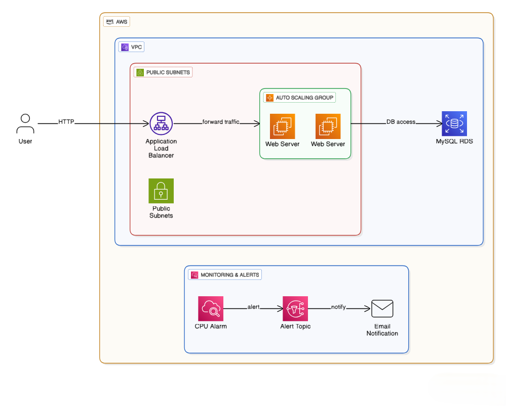

# Scalable Web Application on AWS (ALB + ASG)

This project deploys a simple, highly-available EC2-based web application on AWS using an Application Load Balancer (ALB) and an Auto Scaling Group (ASG). It also includes optional Amazon RDS (MySQL), IAM for SSM access, and basic monitoring/alerting via CloudWatch and SNS.

## Architecture Diagram



> Note: The current Terraform configuration places both EC2 and RDS in public subnets and uses a single security group for ALB + EC2. See Improvements for production hardening.

## Components
- **VPC + Subnets**: 1 VPC, 2 public subnets across `us-east-1a` and `us-east-1b`, an Internet Gateway, and public route table associations.
- **Security Groups**:
  - `web_sg`: Inbound TCP 80 from anywhere; egress all.
  - `rds_sg`: Inbound TCP 3306 from `web_sg`; egress all.
- **Compute**:
  - Launch Template: Amazon Linux 2 `t2.micro`, SSM instance profile, user data installs Apache and serves a basic page.
  - ASG: subnets in two AZs, desired=2, min=1, max=2, attached to Target Group.
- **Load Balancing**: Application Load Balancer with HTTP listener (80) forwarding to Target Group (port 80).
- **Database (Optional)**: MySQL `db.t3.micro` single-AZ, publicly accessible in public subnets (for simplicity/demo).
- **Monitoring & Alerts**: CloudWatch CPU alarm -> SNS topic -> email subscription.

## Deploy
Prereqs:
- Terraform v1.6+ (or latest)
- AWS account with credentials configured (e.g., via `aws configure`)
- Set your AWS region in `main.tf` or via environment variable `AWS_REGION`

Steps:
1. Clone this repository.
2. In `main.tf`, update:
   - `provider.aws.region` if needed.
   - `aws_sns_topic_subscription.email_sub.endpoint` to your email.
3. Initialize and deploy:
   ```bash
   terraform init
   terraform plan
   terraform apply -auto-approve
   ```
4. Confirm the SNS email subscription (check your inbox and click Confirm).
5. After apply completes, Terraform will output `alb_dns_name`. Open it in a browser to reach your web app.

## Costs & Free Tier Notes
- **ALB**: not Free Tier; billed per hour + LCU usage.
- **EC2**: use `t2.micro`/`t3.micro`; up to 750 hrs/month total across instances in Free Tier.
- **RDS**: Single-AZ `db.t3.micro` can be Free Tier; Multi-AZ is not. Publicly accessible is for demo only.
- **CloudWatch**: basic metrics free; each alarm ~ $0.10/month.
- **SNS**: generous free tier for email notifications.

To minimize cost, you can:
- Set ASG `desired_capacity=1` and `max_size=1` while testing, then scale up for demos.
- Remove or comment out the RDS resources if not needed.

## Improvements (Production Hardening)
- Use separate security groups for ALB and EC2; restrict EC2 inbound to ALB SG only.
- Switch ASG to `health_check_type = "ELB"` and add `health_check_grace_period`.
- Add target-tracking scaling policy (e.g., 50–60% CPU) for cost/perf optimization.
- Use HTTPS (ACM cert) on ALB with HTTP->HTTPS redirect.
- Place RDS in private subnets, `publicly_accessible=false`, and consider `multi_az=true`.
- Store DB credentials in AWS Secrets Manager or SSM Parameter Store.

## Cleanup
To remove all resources and avoid charges:
```bash
terraform destroy -auto-approve
```
