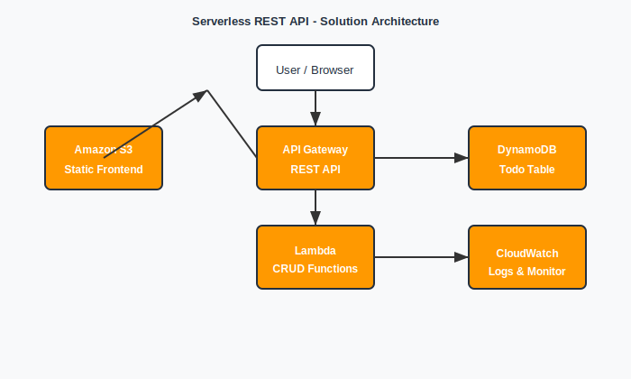

# Serverless REST API with DynamoDB and API Gateway

A complete serverless todo application built with AWS services and Terraform. This project demonstrates how to create a scalable, event-driven serverless application using Amazon API Gateway, AWS Lambda, DynamoDB, and S3.

## Solution Architecture Diagram



## Architecture (ASCII)

```
┌─────────────────┐    ┌─────────────────┐    ┌─────────────────┐
│   S3 Frontend   │    │   API Gateway   │    │   DynamoDB      │
│   (Static Site) │◄───┤   (REST API)    │◄───┤   (NoSQL DB)    │
└─────────────────┘    └─────────────────┘    └─────────────────┘
                                │
                                ▼
                       ┌─────────────────┐
                       │   Lambda        │
                       │   Functions     │
                       │   (CRUD Ops)    │
                       └─────────────────┘
```

## AWS Services Used

- **Amazon API Gateway**: Exposes REST endpoints for CRUD operations
- **AWS Lambda**: Handles API requests with serverless functions
- **Amazon DynamoDB**: NoSQL database for storing todo items
- **AWS IAM**: Controls access via roles and permissions
- **Amazon CloudWatch**: Logs and monitors API activity
- **Amazon S3**: Hosts the frontend application

## Features

- ✅ Complete CRUD operations for todo items
- ✅ Modern, responsive web interface
- ✅ Priority levels (High, Medium, Low)
- ✅ Due dates and descriptions
- ✅ Filter by completion status
- ✅ Real-time updates
- ✅ CORS enabled for cross-origin requests
- ✅ Error handling and validation
- ✅ CloudWatch logging and monitoring

## Prerequisites

- AWS CLI configured with appropriate permissions
- Terraform >= 1.0
- Node.js (for local development)
- Git

## Quick Start

### 1. Clone the Repository

```bash
git clone <repository-url>
cd serverless-todo-api
```

### 2. Configure AWS Credentials

```bash
aws configure
```

### 3. Deploy Infrastructure

**Using PowerShell (Windows):**

```powershell
.\deploy.ps1 -Environment dev -Region us-east-1
```

**Using Bash (Linux/Mac):**

```bash
./deploy.sh --environment dev --region us-east-1
```

### 4. Access the Application

After deployment, you'll get:

- Frontend URL: `http://your-bucket-name.s3-website-us-east-1.amazonaws.com`
- API Gateway URL: `https://your-api-id.execute-api.us-east-1.amazonaws.com/dev`

## Manual Deployment

### 1. Initialize Terraform

```bash
terraform init
```

### 2. Plan Deployment

```bash
terraform plan -var="environment=dev" -var="aws_region=us-east-1"
```

### 3. Apply Configuration

```bash
terraform apply -var="environment=dev" -var="aws_region=us-east-1"
```

### 4. Upload Frontend

```bash
# Get the S3 bucket name from Terraform outputs
FRONTEND_BUCKET=$(terraform output -raw frontend_bucket_name)

# Upload frontend files
aws s3 sync frontend/ s3://$FRONTEND_BUCKET/ --delete
```

## API Endpoints

| Method | Endpoint        | Description         |
| ------ | --------------- | ------------------- |
| GET    | `/todos`      | List all todos      |
| POST   | `/todos`      | Create a new todo   |
| GET    | `/todos/{id}` | Get a specific todo |
| PUT    | `/todos/{id}` | Update a todo       |
| DELETE | `/todos/{id}` | Delete a todo       |

### Example API Usage

**Create a todo:**

```bash
curl -X POST https://your-api-id.execute-api.us-east-1.amazonaws.com/dev/todos \
  -H "Content-Type: application/json" \
  -d '{
    "title": "Learn AWS",
    "description": "Complete the AWS Solutions Architect course",
    "priority": "high",
    "due_date": "2024-12-31"
  }'
```

**List all todos:**

```bash
curl https://your-api-id.execute-api.us-east-1.amazonaws.com/dev/todos
```

## Project Structure

```
├── main.tf                 # Main Terraform configuration
├── variables.tf            # Terraform variables
├── outputs.tf              # Terraform outputs
├── lambda_functions/       # Lambda function source code
│   ├── create_todo.py
│   ├── read_todo.py
│   ├── update_todo.py
│   ├── delete_todo.py
│   └── list_todos.py
├── frontend/               # Frontend application
│   ├── index.html
│   ├── app.js
│   └── error.html
├── deploy.ps1             # PowerShell deployment script
├── deploy.sh              # Bash deployment script
└── README.md              # This file
```

## Configuration

### Environment Variables

You can customize the deployment using Terraform variables:

```hcl
# terraform.tfvars
aws_region = "us-west-2"
environment = "production"
project_name = "my-todo-app"
lambda_timeout = 60
lambda_memory_size = 256
log_retention_days = 30
```

### Lambda Function Configuration

Each Lambda function is configured with:

- Runtime: Python 3.9
- Timeout: 30 seconds (configurable)
- Memory: 128 MB (configurable)
- Environment variables for DynamoDB table name

## Monitoring and Logging

- **CloudWatch Logs**: Each Lambda function has its own log group
- **API Gateway Logs**: Request/response logging enabled
- **DynamoDB Metrics**: Available in CloudWatch
- **Lambda Metrics**: Duration, errors, invocations

## Security

- IAM roles with least privilege access
- DynamoDB encryption at rest
- API Gateway CORS configuration
- Input validation and sanitization
- Error handling without exposing sensitive information

## Cost Optimization

- DynamoDB on-demand billing (pay per request)
- Lambda functions with minimal memory allocation
- S3 static website hosting (cost-effective)
- CloudWatch log retention (14 days by default)

## Troubleshooting

### Common Issues

1. **API Gateway CORS errors**

   - Ensure CORS is properly configured in the Lambda functions
   - Check that the frontend is making requests to the correct API URL
2. **Lambda function errors**

   - Check CloudWatch logs for detailed error messages
   - Verify IAM permissions for DynamoDB access
3. **DynamoDB access issues**

   - Ensure the Lambda execution role has DynamoDB permissions
   - Check that the table name environment variable is correct

### Debugging Commands

```bash
# Check Lambda function logs
aws logs describe-log-groups --log-group-name-prefix "/aws/lambda/todo-"

# Test API Gateway
curl -v https://your-api-id.execute-api.us-east-1.amazonaws.com/dev/todos

# Check DynamoDB table
aws dynamodb describe-table --table-name your-table-name
```

## Cleanup

To destroy all resources:

```bash
# Using deployment script
./deploy.sh --destroy

# Or manually
terraform destroy -var="environment=dev" -var="aws_region=us-east-1"
```

## Learning Outcomes

This project demonstrates:

- ✅ Designing scalable, event-driven serverless applications
- ✅ Implementing API Gateway with Lambda for stateless execution
- ✅ Using DynamoDB as a managed NoSQL database with best practices
- ✅ Securing APIs with IAM roles and resource policies
- ✅ Infrastructure as Code with Terraform
- ✅ Frontend-backend integration
- ✅ Error handling and monitoring
- ✅ Cost optimization strategies

## Contributing

1. Fork the repository
2. Create a feature branch
3. Make your changes
4. Test thoroughly
5. Submit a pull request

## License

This project is licensed under the MIT License - see the LICENSE file for details.

## Support

For questions or issues:

1. Check the troubleshooting section
2. Review CloudWatch logs
3. Open an issue in the repository
